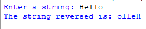
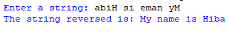

## Description
This program, without using functions, prompts the user to enter a string. It then iterates through each character of the input string and constructs the reversed string by adding each character to the beginning of it. Finally, it displays the reversed string to the user, labeled as "The reversed string."
## Example
♡ Example 1  
  
♡ Example 2  

